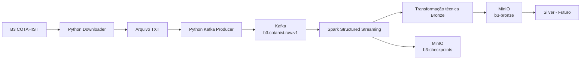

# B3 Data Platform

Plataforma de dados para ingestão e processamento de arquivos históricos **COTAHIST da B3**, utilizando Python, Kafka, Spark Structured Streaming e MinIO.

O projeto atualmente implementa o fluxo de ingestão até a camada **Bronze**, preservando os registros brutos da B3 para processamento posterior.

---

## Arquitetura

O fluxo atual da plataforma é:



### Fluxo detalhado

```text
B3
 │
 │ Download HTTP
 ▼
Python Downloader
 │
 │ COTAHIST_DDDMMAAAA.TXT
 ▼
Arquivo COTAHIST
 │
 │ 1 linha = 1 evento
 ▼
Python Kafka Producer
 │
 │ JSON
 ▼
Kafka
b3.cotahist.raw.v1
 │
 │ Structured Streaming
 ▼
Apache Spark
 │
 ├── preserva kafka_key
 ├── preserva kafka_value
 ├── preserva topic
 ├── preserva partition
 ├── preserva offset
 ├── preserva timestamp
 ├── interpreta envelope JSON
 └── mantém raw_record intacto
 │
 ▼
MinIO
 │
 ├── b3-bronze
 │
 │   └── b3/cotahist/
 │       └── ingestion_date=YYYY-MM-DD/
 │           └── *.parquet
 │
 └── b3-checkpoints
     └── b3/cotahist/
```

---

# Tecnologias

Atualmente o projeto utiliza:

* Python
* Apache Kafka
* Apache Spark 4.2
* Spark Structured Streaming
* PySpark
* MinIO
* S3A
* Docker
* Docker Compose
* Parquet
* Pytest

---

# Estrutura do projeto

```text
b3-data-platform/
│
├── config/
│   └── settings.py
│
├── downloader/
│   ├── __init__.py
│   ├── download_cotahist.py
│   └── data/
│
├── producer/
│   ├── __init__.py
│   └── cotahist_producer.py
│
├── streaming/
│   ├── __init__.py
│   └── bronze/
│       ├── __init__.py
│       └── cotahist_bronze_stream.py
│
├── shared/
│   └── logging/
│       └── application_logger.py
│
├── infra/
│   └── minio/
│       └── spark-policy.json
│
├── tests/
│   └── unit/
│       ├── producer/
│       │   └── test_cotahist_producer.py
│       │
│       └── streaming/
│           └── bronze/
│               ├── conftest.py
│               └── test_cotahist_bronze_stream.py
│
├── logs/
│
├── .env
├── .env.example
├── docker-compose.yml
├── requirements.txt
├── requirements-dev.txt
└── README.md
```

---

# Instalação

Crie o ambiente virtual:

```bash
python -m venv .venv
```

Linux/macOS:

```bash
source .venv/bin/activate
```

Windows PowerShell:

```powershell
.venv\Scripts\activate
```

Instale as dependências:

```bash
pip install -r requirements.txt
```

Para desenvolvimento e execução dos testes:

```bash
pip install -r requirements-dev.txt
```

---

# Configuração do ambiente

Crie um arquivo `.env` na raiz do projeto.

Exemplo:

```dotenv
MINIO_ROOT_USER=minioadmin
MINIO_ROOT_PASSWORD=change-me

MINIO_SPARK_ACCESS_KEY=spark-b3
MINIO_SPARK_SECRET_KEY=change-me
```

O `.env` não deve ser versionado.

Adicione ao `.gitignore`:

```gitignore
.env
```

---

# Infraestrutura

A infraestrutura local é executada com Docker Compose.

Ela contém:

```text
Kafka
Kafka Init

MinIO
MinIO Init

Spark Master
Spark Worker
Spark Structured Streaming
```

---

## Subindo a infraestrutura

```bash
docker compose up -d
```

Verifique os containers:

```bash
docker compose ps -a
```

O estado esperado é aproximadamente:

```text
b3-kafka              Up (healthy)
b3-kafka-init         Exited (0)

b3-minio              Up
b3-minio-init         Exited (0)

b3-spark-master       Up
b3-spark-worker       Up
b3-spark-streaming    Up
```

Os containers:

```text
kafka-init
minio-init
```

executam apenas tarefas de inicialização e encerram normalmente com:

```text
Exited (0)
```

---

# Interfaces locais

## Spark Master

```text
http://localhost:8080
```

## Spark Worker

```text
http://localhost:8081
```

## Spark Structured Streaming

```text
http://localhost:4040
```

## MinIO Console

```text
http://localhost:9001
```

## Kafka

Aplicações executadas na máquina host utilizam:

```text
localhost:9092
```

Containers Docker utilizam:

```text
kafka:29092
```

---

# Downloader COTAHIST

O downloader é responsável por baixar os arquivos COTAHIST disponibilizados pela B3.

---

## Download anual

```bash
python -m downloader.download_cotahist --year 2025
```

---

## Download diário

```bash
python -m downloader.download_cotahist --date 2026-09-11
```

---

## Download sem extrair o ZIP

```bash
python -m downloader.download_cotahist --year 2025 --no-extract
```

Os arquivos baixados ficam em:

```text
downloader/data/
```

Exemplo:

```text
downloader/data/COTAHIST_D11092026.TXT
```

---

# Logs da aplicação Python

Os logs das aplicações Python ficam em:

```text
logs/
```

Cada execução possui arquivo próprio contendo UUID e timestamp.

---

# Kafka Producer

O producer lê o arquivo COTAHIST linha por linha e envia cada linha como um evento independente para Kafka.

Executar:

```bash
python -m producer.cotahist_producer \
    --file downloader/data/COTAHIST_D11092026.TXT
```

Windows PowerShell:

```powershell
python -m producer.cotahist_producer `
    --file downloader/data/COTAHIST_D11092026.TXT
```

---

## Topic

Os eventos são publicados no topic:

```text
b3.cotahist.raw.v1
```

O topic é criado automaticamente pelo container:

```text
kafka-init
```

---

## Estratégia de mensagens

Cada linha do arquivo COTAHIST representa uma mensagem Kafka.

```text
1 linha COTAHIST
        =
1 evento Kafka
```

São enviados inclusive:

```text
00 → Header
01 → Registro de detalhe
99 → Trailer
```

A chave Kafka é:

```text
file_name
```

Exemplo:

```text
COTAHIST_D11092026.TXT
```

Isso garante que as linhas do mesmo arquivo sejam encaminhadas para a mesma partição Kafka, preservando sua ordem.

---

# Estrutura do evento Kafka

Exemplo:

```json
{
  "schema_version": 1,
  "event_id": "COTAHIST_D11092026.TXT:2",
  "source": "B3",
  "dataset": "COTAHIST",
  "file_name": "COTAHIST_D11092026.TXT",
  "file_date": "2026-09-11",
  "line_number": 2,
  "record_type": "01",
  "raw_record": "0120260911...",
  "ingested_at": "2026-09-14T18:00:00Z"
}
```

O campo mais importante é:

```text
raw_record
```

Ele contém a linha COTAHIST original sem interpretação das posições fixas.

---

# Bronze Layer

O Spark Structured Streaming consome continuamente o topic:

```text
b3.cotahist.raw.v1
```

e persiste os eventos no MinIO.

A camada Bronze **não interpreta os campos de negócio do COTAHIST**.

Campos como:

```text
ticker
preço de abertura
preço de fechamento
volume
quantidade de negócios
ISIN
```

serão tratados posteriormente na camada Silver.

---

## Dados preservados na Bronze

A Bronze mantém tanto o evento Kafka original quanto os metadados da mensagem.

Exemplo de colunas:

```text
kafka_key
kafka_value

kafka_topic
kafka_partition
kafka_offset
kafka_timestamp

schema_version
event_id
source
dataset

file_name
file_date
line_number
record_type

raw_record
ingested_at

parse_status
ingestion_date
```

---

# Rastreabilidade

Existem dois níveis de preservação dos dados brutos.

## Kafka original

```text
kafka_value
```

Contém o JSON integral recebido pelo Spark.

## COTAHIST original

```text
raw_record
```

Contém a linha original do arquivo B3.

Assim é possível reconstruir ou reprocessar os dados posteriormente.

---

# JSON inválido

Eventos que não podem ser interpretados pelo Spark não são descartados.

Eles são armazenados com:

```text
parse_status = INVALID_JSON
```

Eventos válidos recebem:

```text
parse_status = OK
```

A Bronze prioriza preservação do dado recebido em vez de descarte silencioso.

---

# MinIO

Dois buckets são utilizados.

## Dados Bronze

```text
b3-bronze
```

Estrutura:

```text
b3-bronze/
└── b3/
    └── cotahist/
        └── ingestion_date=YYYY-MM-DD/
            ├── part-*.snappy.parquet
            └── _spark_metadata/
```

---

## Spark Checkpoints

```text
b3-checkpoints
```

Estrutura:

```text
b3-checkpoints/
└── b3/
    └── cotahist/
        ├── commits/
        ├── offsets/
        ├── sources/
        └── metadata
```

Os checkpoints permitem que o Spark retome o processamento após reinicializações sem precisar consumir todo o Kafka novamente.

---

# Particionamento Bronze

Os arquivos Parquet são particionados por:

```text
ingestion_date
```

Exemplo:

```text
b3/cotahist/
└── ingestion_date=2026-09-14/
```

É importante distinguir:

```text
file_date
```

Data referente ao arquivo COTAHIST da B3.

e:

```text
ingestion_date
```

Data em que a mensagem foi processada pelo pipeline Bronze.

---

# Structured Streaming

O job Spark roda continuamente dentro do container:

```text
b3-spark-streaming
```

Depois de iniciado, não é necessário executar manualmente o consumer.

O fluxo acontece automaticamente:

```text
Producer
   ↓
Kafka
   ↓
Spark Structured Streaming
   ↓
MinIO
```

---

# Verificando o Spark Streaming

Logs:

```bash
docker compose logs -f spark-streaming
```

Interface:

```text
http://localhost:4040
```

Na interface de Structured Streaming é possível acompanhar:

```text
numInputRows
startOffset
endOffset
latestOffset
```

Quando:

```text
endOffset == latestOffset
```

em todas as partições Kafka, o Spark alcançou o final atual do topic.

Quando o próximo micro-batch apresenta:

```text
numInputRows = 0
```

o pipeline está sem backlog naquele momento.

---

# Verificando mensagens no Kafka

Listar topics:

```bash
docker exec b3-kafka \
    /opt/kafka/bin/kafka-topics.sh \
    --bootstrap-server localhost:29092 \
    --list
```

Consumir algumas mensagens:

```bash
docker exec -it b3-kafka \
    /opt/kafka/bin/kafka-console-consumer.sh \
    --bootstrap-server localhost:29092 \
    --topic b3.cotahist.raw.v1 \
    --from-beginning \
    --max-messages 3
```

---

# Executando o pipeline completo

## 1. Subir infraestrutura

```bash
docker compose up -d
```

## 2. Baixar COTAHIST

```bash
python -m downloader.download_cotahist --date 2026-09-11
```

## 3. Publicar no Kafka

```bash
python -m producer.cotahist_producer \
    --file downloader/data/COTAHIST_D11092026.TXT
```

## 4. Spark processa automaticamente

O container:

```text
b3-spark-streaming
```

consome as mensagens e grava os dados no bucket:

```text
b3-bronze
```

---

# Testes

Os testes utilizam Pytest.

---

## Testes do Producer

```bash
python -m pytest tests/unit/producer -v
```

---

## Testes da Bronze

```bash
python -m pytest tests/unit/streaming/bronze -v
```

Os testes Bronze validam:

```text
schema do evento
variáveis de ambiente obrigatórias
transformação Kafka → Bronze
preservação do raw_record
preservação de espaços fixed-width
header/detail/trailer
JSON inválido
configuração do Kafka reader
configuração do Parquet writer
configuração S3A/MinIO
orquestração do pipeline
```

Para os testes de transformação é utilizado:

```text
Spark local[1]
```

sem necessidade de Kafka ou MinIO reais.

---

## Executar todos os testes

```bash
python -m pytest -v
```

---

# Monitoramento dos containers

Para acompanhar consumo de CPU e memória:

```bash
docker stats
```

---

# Reset completo do ambiente Docker

Para remover containers, volumes, dados do Kafka, MinIO e checkpoints:

```bash
docker compose down -v --remove-orphans
```

Depois:

```bash
docker compose up -d
```

> Esse comando remove todos os dados persistidos localmente pelos volumes Docker do projeto.

---

# Arquitetura atual

Atualmente o projeto possui:

```text
Download
   ✅

COTAHIST TXT
   ✅

Kafka Producer
   ✅

Kafka
   ✅

Spark Structured Streaming
   ✅

Bronze
   ✅

MinIO
   ✅

Checkpoints
   ✅

Testes unitários
   ✅
```

---

# Próximos passos

As próximas evoluções previstas são:

```text
Bronze
   ↓
Silver
   ↓
Parsing Fixed Width COTAHIST
   ↓
Tipagem dos campos
   ↓
Validações
   ↓
Deduplicação
   ↓
Dados estruturados
```

Na camada Silver será realizada a interpretação das posições fixas do COTAHIST utilizando Spark.

Posteriormente poderão ser adicionadas outras camadas e funcionalidades, como:

```text
Gold
consultas analíticas
Apache Iceberg ou Delta Lake
orquestração
data quality
observabilidade
CI/CD
testes de integração
```

---

## Objetivo do projeto

Além de construir uma plataforma funcional para dados da B3, este projeto tem como objetivo explorar na prática conceitos de engenharia de dados como:

```text
streaming
event-driven architecture
Kafka
Spark
medallion architecture
object storage
Parquet
S3
checkpointing
idempotência
rastreabilidade
data lake
testes de pipelines
```
